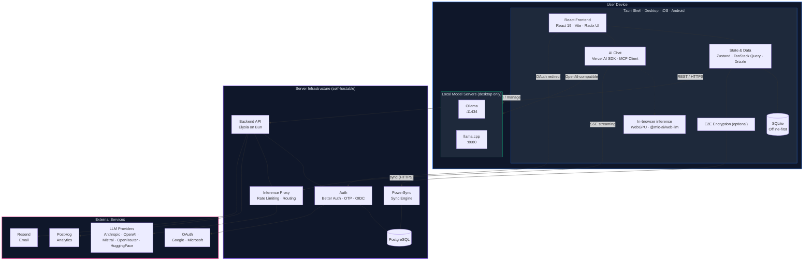

# Thunderbolt Architecture

> **Boundary key:** Blue = on-device · Green = local model server · Purple = self-hosted server · Pink = third-party SaaS

## Key Architectural Properties

- **Offline-first**: Local SQLite is the source of truth. The app works without network.
- **Cross-platform**: A single React codebase runs in Tauri on desktop (macOS, Linux, Windows) and mobile (iOS, Android).
- **Model-agnostic**: LLM calls route through the backend inference proxy for managed providers (Claude, GPT, Mistral, OpenRouter), or directly to local/third-party endpoints for Ollama, llama.cpp, HuggingFace, and in-browser WebGPU. See [Local Models](./local-models.md).
- **Zero-data-leaves-device mode**: When the user selects an Ollama, llama.cpp, or in-browser model, inference runs entirely on the user's machine — the backend inference proxy is never called.
- **Self-hostable**: The entire server stack (backend, PostgreSQL, PowerSync, Keycloak) runs via Docker Compose.
- **E2E Encrypted (optional)**: When enabled, data is encrypted before leaving the device and the server stores only ciphertext. See [E2E Encryption](./e2e-encryption.md) for details.

> ⚠️ **Note:** Multi-device sync is under active development and is subject to further refinements.

> ⚠️ **Note:** End-to-end encryption is under active development, has not yet undergone a cryptography audit, and is subject to further refinements.
